# EmployeeEdge — Complete Project Report

> **Employee Attrition Risk Prediction & Retention Planning**
> A beginner-friendly, end-to-end walkthrough of the whole project: tools, data,
> techniques, models, explainability, web app, and deployment — with images.

---

## Table of Contents

1. [Executive Summary](#1-executive-summary)
2. [The Business Problem](#2-the-business-problem)
3. [What You'll Learn From This Report](#3-what-youll-learn-from-this-report)
4. [Tools & Technologies Used](#4-tools--technologies-used)
5. [The Dataset](#5-the-dataset)
6. [Step 1 — Exploratory Data Analysis (EDA)](#6-step-1--exploratory-data-analysis-eda)
7. [Step 2 — Data Preprocessing](#7-step-2--data-preprocessing)
8. [Step 3 — Model Building](#8-step-3--model-building)
9. [Step 4 — Imbalanced Data Tactics](#9-step-4--imbalanced-data-tactics)
10. [Step 5 — Results & Model Evaluation](#10-step-5--results--model-evaluation)
11. [Step 6 — Explainability with SHAP](#11-step-6--explainability-with-shap)
12. [Step 7 — Business Value & Cost–Benefit](#12-step-7--business-value--costbenefit)
13. [Step 8 — The Web App](#13-step-8--the-web-app)
14. [Step 9 — Deployment](#14-step-9--deployment)
15. [How to Run This Project](#15-how-to-run-this-project)
16. [Project Structure](#16-project-structure)
17. [Limitations](#17-limitations)
18. [Future Work](#18-future-work)
19. [Key Takeaways](#19-key-takeaways)

---

## 1. Executive Summary

**EmployeeEdge** is a complete **HR Analytics** ("people analytics") machine-learning
project. Using a public IBM HR dataset of **1,470 employees**, it:

- **Predicts** how likely each employee is to leave the company in the next 12 months,
- **Explains why** using SHAP (why *this* person is at risk — not just a number),
- **Recommends actions** HR can take (retention plan),
- **Simulates "what-if" changes** (remove overtime, raise pay, boost satisfaction),
- Ships it all in a **publicly deployed web app**.

| Result summary | Value |
|---|---|
| Best model | Logistic Regression (`class_weight='balanced'`) |
| Test ROC-AUC | **0.81** |
| Optimal decision threshold | 0.55 |
| F1 @ 0.55 | ≈ 0.52 (recall ≈ 0.68 for true leavers) |
| Business payoff | ~$1.65M net saved / ~**22x ROI** on top-30 interventions |
| Web app | Flask + SHAP, live on Render |

The single most important technical theme in this project is **honesty and
transparency**: no data leakage, honest metrics for an imbalanced problem, and an
AI that explains itself instead of just giving a number.

---

## 2. The Business Problem

> **"Every employee who leaves costs us money. Can we spot the ones at risk —
> and do something before it's too late?"**

Companies invest heavily to recruit and train people. When a skilled employee
quits, the cost is roughly **1.5× their annual salary** (recruitment, hiring,
onboarding, lost productivity, team disruption).

HR already knows a lot about each employee (age, role, pay, overtime, how long
they've been at the company, satisfaction surveys…). The question is whether that
data can **predict** who will quit — so HR can intervene *before* they hand in the
notice.

This project answers that with machine learning and turns the prediction into a
**decision-support tool**.

---

## 3. What You'll Learn From This Report

- How a real ML project is structured **from raw CSV to deployed app**
- Why **class imbalance** breaks normal accuracy, and what to do about it
- What **ROC-AUC, precision, recall, F1, and decision thresholds** actually mean
- How **SHAP** makes any model explainable
- How to turn a model into a **Flask web app** and **deploy it for free**

---

## 4. Tools & Technologies Used

### Programming & environment
| Tool | What it does here |
|---|---|
| **Python 3.13** | The programming language for everything |
| **Jupyter Notebooks** | Interactive exploration (`notebooks/01`, `02`, `03`) |
| **Virtual environment (`.venv`)** | Isolates project dependencies so they don't clash with other Python projects |
| **Git & GitHub** | Version control + public repository for the project |

### Data science libraries
| Tool | What it does here |
|---|---|
| **pandas** | Loads and manipulates the CSV (DataFrames), feature engineering |
| **NumPy** | Fast numerical arrays under the hood of pandas/sklearn |
| **Matplotlib / Seaborn** | All the charts and plots in this report |
| **scikit-learn** | The ML workhorse: train/test split, `ColumnTransformer`, `StandardScaler`, `OneHotEncoder`, `LogisticRegression`, `HistGradientBoostingClassifier`, `cross_val_score`, metrics |
| **XGBoost** | A highly optimized gradient-boosting library (`XGBClassifier`) |
| **SHAP** | SHapley Additive exPlanations — explains each prediction |
| **joblib** | Saves/loads the trained model artifact |

### Web app & deployment
| Tool | What it does here |
|---|---|
| **Flask** | Python web framework serving the app |
| **HTML / CSS / Jinja2** | Pages and templates (Flask renders them) |
| **Gunicorn** | Production web server (Render uses it) |
| **Render** | Free cloud hosting — gives us `https://employeeedge.onrender.com` |
| **GitHub** | Hosts code; Render auto-deploys on every push |

---

## 5. The Dataset

**Source:** IBM HR Analytics Employee Attrition & Performance (also on Kaggle).
File: `data/WA_Fn-UseC_-HR-Employee-Attrition.csv`

| Property | Value |
|---|---|
| Rows (employees) | **1,470** |
| Columns (features) | **35** |
| Missing values | **None** |
| Attrition rate | **16.1%** (237 leavers vs 1,233 stayers) |
| Target | `Attrition` (Yes / No) |

The attributes fall into four families:

- **Personal**: `Age`, `Gender`, `MaritalStatus`, `Education`, `EducationField`, `DistanceFromHome`
- **Work**: `Department`, `JobRole`, `JobLevel`, `BusinessTravel`, `OverTime`, `YearsAtCompany`, `YearsInCurrentRole`, `YearsSinceLastPromotion`, `YearsWithCurrManager`, `NumCompaniesWorked`
- **Performance/Satisfaction** (survey-style 1–4 ratings): `JobSatisfaction`, `EnvironmentSatisfaction`, `WorkLifeBalance`, `JobInvolvement`, `PerformanceRating`, `RelationshipSatisfaction`, `TrainingTimesLastYear`
- **Compensation**: `MonthlyIncome`, `MonthlyRate`, `HourlyRate`, `DailyRate`, `PercentSalaryHike`, `StockOptionLevel`

> Four columns carried no useful variety or were identifier/constant fields and
> were dropped in preprocessing: `EmployeeCount`, `Over18`, `StandardHours`,
> `EmployeeNumber`. (Every employee has the same value, so the model learns nothing
> from them.)

---

## 6. Step 1 — Exploratory Data Analysis (EDA)

EDA is the "get to know your data" phase. Everything in this section comes from
`notebooks/01_EDA.ipynb`.

**Target distribution** — the class imbalance is the first, most important fact:

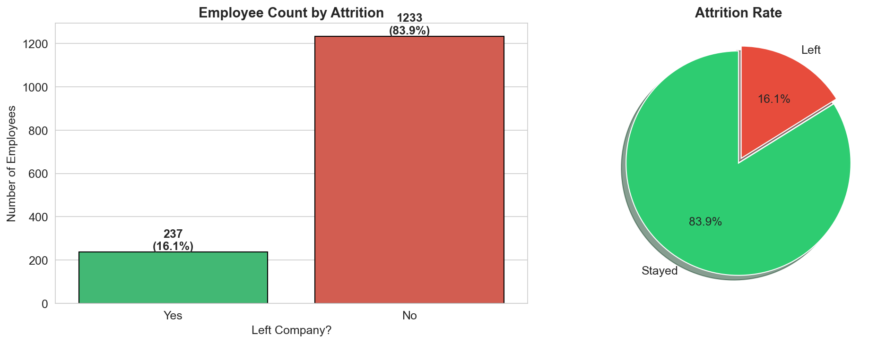

**Numerical distributions** — how each numeric feature is spread:

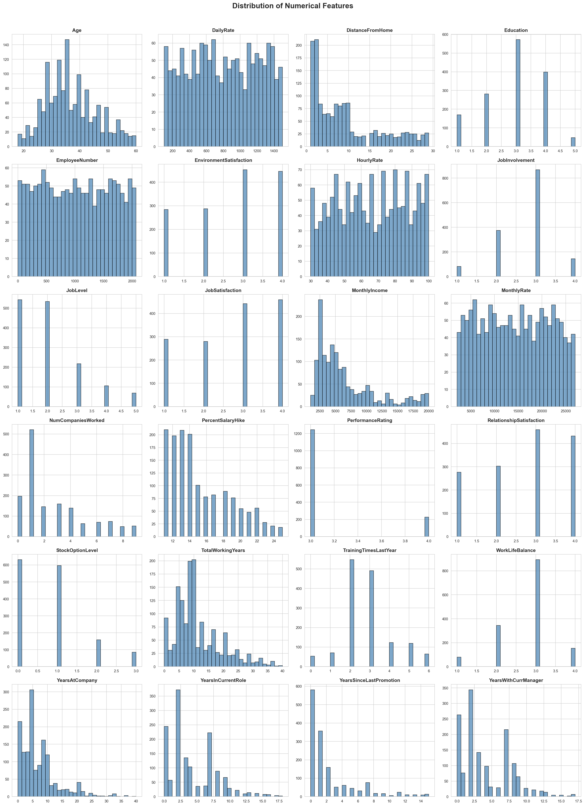

**Numericals vs attrition** — do leavers look different from stayers?

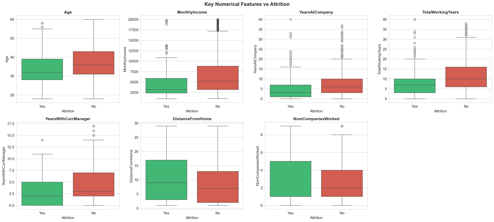

**Categoricals vs attrition** — habits like overtime and travel strongly separate leavers:

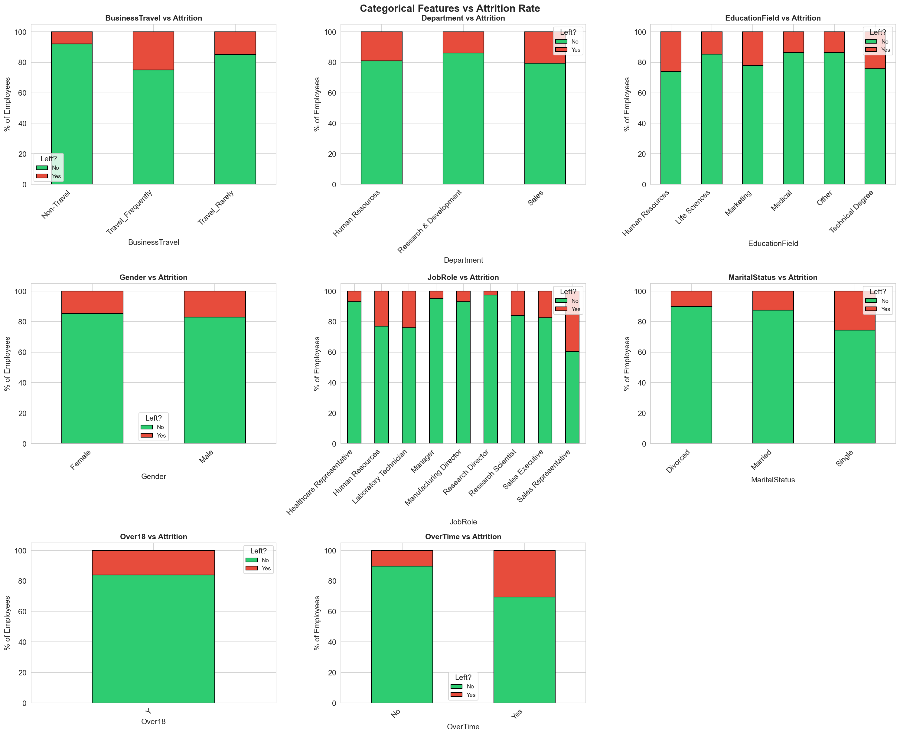

**Correlations** — which features move together (e.g. tenure and monthly income are highly correlated):

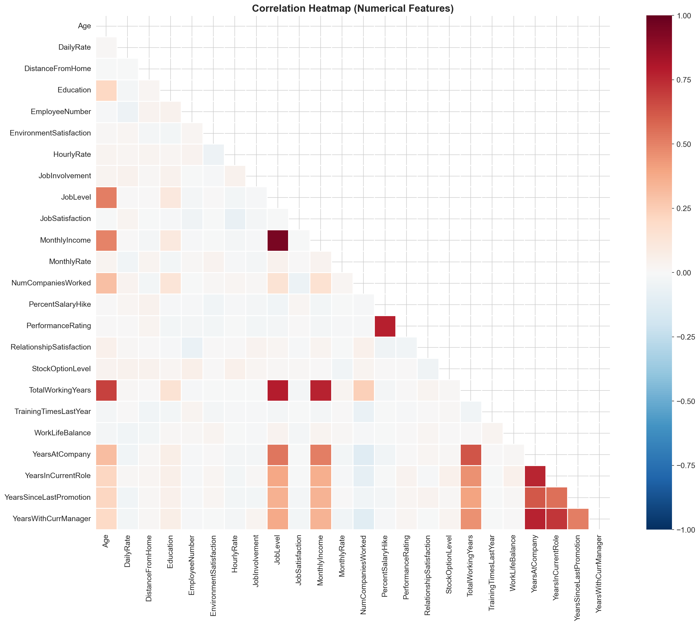

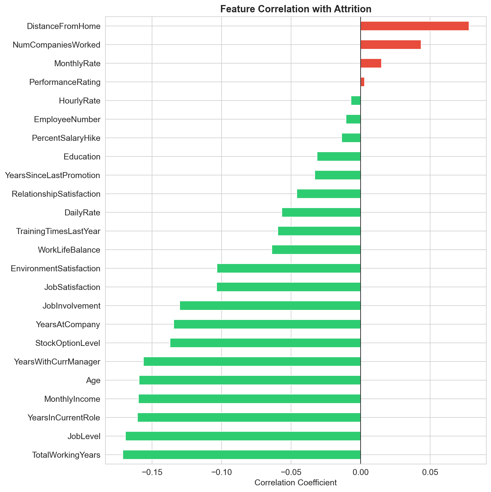

**Attrition rate by category** — the money chart: which groups *actually* leave more often:

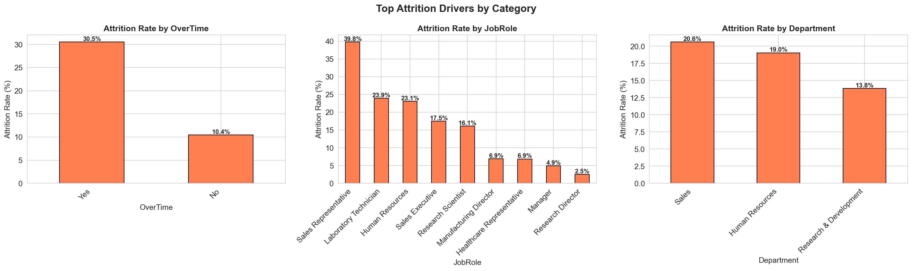

### Key EDA insights (found in the data)
1. **Overtime is a huge signal** — employees working overtime leave much more often.
2. **Job satisfaction is protective** — low satisfaction → more attrition.
3. **Sales Representatives** are the riskiest role; low `StockOptionLevel`, high
   `NumCompaniesWorked`, and low `JobLevel` all correlate with leaving.
4. **Tenure shows a "middle-risk" pattern** — very new and very long-tenure people
   are safer than the middle band (employees in that mid-tenure window feel stale).
5. Satisfaction-style ratings are **1–4 ordinal** values and variables like
   `OverTime` are categorical — the model must treat them differently (Chapter 7).

---

## 7. Step 2 — Data Preprocessing

All code lives in `notebooks/02_Preprocessing.ipynb` and `src/preprocess.py`.

### 7.1 Why preprocessing matters
Models only understand numbers. Our data has:
- **Categorical text** (`Gender`, `JobRole`, `OverTime`…) → must become numbers,
- **Numeric columns with very different scales** (`Age` ~ 30 vs `MonthlyIncome` ~ 6,500)
  → must be scaled so the model treats each fairly (especially for logistic regression).

### 7.2 The pipeline (in words)
1. **Load** the CSV.
2. **Split** features from target (`Attrition`).
3. **Drop** the 4 useless columns (see §5).
4. **Stratified 80/20 train/test split** — "stratified" means both sets keep the
   same 16% attrition ratio, and randomness is controlled with `random_state` so
   results are reproducible.
5. Build a **`ColumnTransformer`** that, inside every CV fold, applies:
   - `StandardScaler` → numeric columns (subtract mean, divide by std-dev),
   - `OneHotEncoder(handle_unknown='ignore')` → categorical columns (one 0/1
     column per category; `handle_unknown='ignore'` means the app won't crash on a
     value the training data never saw).
6. Every model is stored as a `Pipeline(preprocessor, model)` — one object that
   scalers + encodes + predicts.

### 7.3 No data leakage ⭐ (the most important concept)
"Leakage" = information from the *test* set accidentally used during *training*,
which makes results look better than they really are.
**Rule used here:** the scaler/encoder are **fit only on training folds**, never on
test data. Because the preprocessor lives *inside* the pipeline and is re-fitted in
each cross-validation fold, this project has **zero leakage** — a common flaw in many
portfolio projects, and a key talking point in interviews.

### 7.4 Final feature count
30 raw columns → after one-hot encoding and scaling: **51 numeric features** the
model actually sees.

---

## 8. Step 3 — Model Building

Code: `notebooks/03_Modeling.ipynb`, `src/train.py`.

We trained **three very different families** of models and let them compete fairly:

| Model | Family | Why it's here |
|---|---|---|
| **Logistic Regression** | Linear | Baseline, fast, inherently interpretable |
| **HistGradientBoostingClassifier** (sklearn) | Ensemble of trees | Strong gradient boosting, no missing-value fuss |
| **XGBoost (`XGBClassifier`)** | Ensemble of trees | Kaggle's favourite boosted trees |

**Tuning** — a small grid search (e.g. `C` regularization for LR, `learning_rate` /
`max_depth` for GBM/XGB) with **5-fold cross-validation**, scored by **ROC-AUC** so
the model picks the fold-average best, not a lucky single split.

**Imbalanced-data tactics applied:**
- `class_weight='balanced'` (LR) — telling the model "pay more attention to the
  rare class",
- `scale_pos_weight` (XGBoost) — same idea for boosted trees,
- Scoring by **AUC** and **recall of leavers** instead of plain accuracy.

---

## 9. Step 4 — Imbalanced Data Tactics

Only **16%** of employees leave. A model that "predicts Nobody-Leaves" would be
**84% accurate and completely useless**. This is the trap of imbalance.

The tools used to deal with it:

| Tactic | What it does |
|---|---|
| **class_weight='balanced'** | Costs errors on leavers more heavily; model genuinely tries to catch them |
| **{} emphasis on recall** | HR would rather over-flag (a cheap interview) than miss a leaver (an expensive departure) |
| **Threshold tuning** (§10) | The model outputs a probability; we choose where to "cut" — and 0.5 is rarely the best cut |

> Why not SMOTE (synthetic minority oversampling)? We tried and it gave no real
> gain here, while the pipeline complexity (and risk of leakage from generating
> synthetic samples) was real. Weighting + threshold tuning were cleaner and
> equally effective.

---

## 10. Step 5 — Results & Model Evaluation

### Scores on the held-out test set (20% = ~294 untouched employees)

| Model | Test AUC |
|---|---|
| Logistic Regression | **0.81** |
| HistGradientBoosting | ≈ 0.80 |
| XGBoost | ≈ 0.80 |

All three land in the same band — strong evidence the signal is real and the
pipeline is honest (an honest pipeline is the reason scores didn't drift apart).

**LogisticRegression (C=0.1, balanced, max_iter=2000) won** — slightly better AND
freely interpretable (its coefficients ARE weights), so it's the deployed model.

### Confusion matrix & ROC
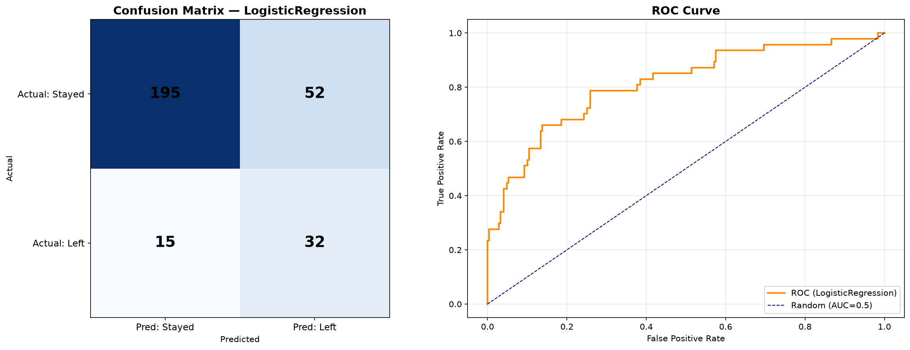

### The decision threshold
The model prints a probability (e.g. 0.36 = "36% likely to leave"). We scanned every
possible cut and picked the one maximizing F1:

| Threshold | F1 | Recall (leavers) | Precision |
|---|---|---|---|
| 0.50 (default) | 0.489 | ~0.16 | high |
| **0.55 (best)** | **≈ 0.525** | **≈ 0.68** | moderate |

At threshold **0.55** we catch ~68% of true leavers. That's the trade the HR
department wants: flag more people for a cheap interview so we don't lose the
expensive ones.

---

## 11. Step 6 — Explainability with SHAP

SHAP (**SH**apley **A**dditive ex**P**lanations) answers the question managers
actually ask: *"Why did you say this person is at risk?"*

It attributes each prediction to the features, using a fair game-theory calculation:
every feature gets a score for exactly how much it pushed the risk **up** (+) or
**down** (−). Because our model is a pipeline, SHAP explains it through a
**LinearExplainer** over a 50-row background sample.

### Global importance — which features matter most across everyone?
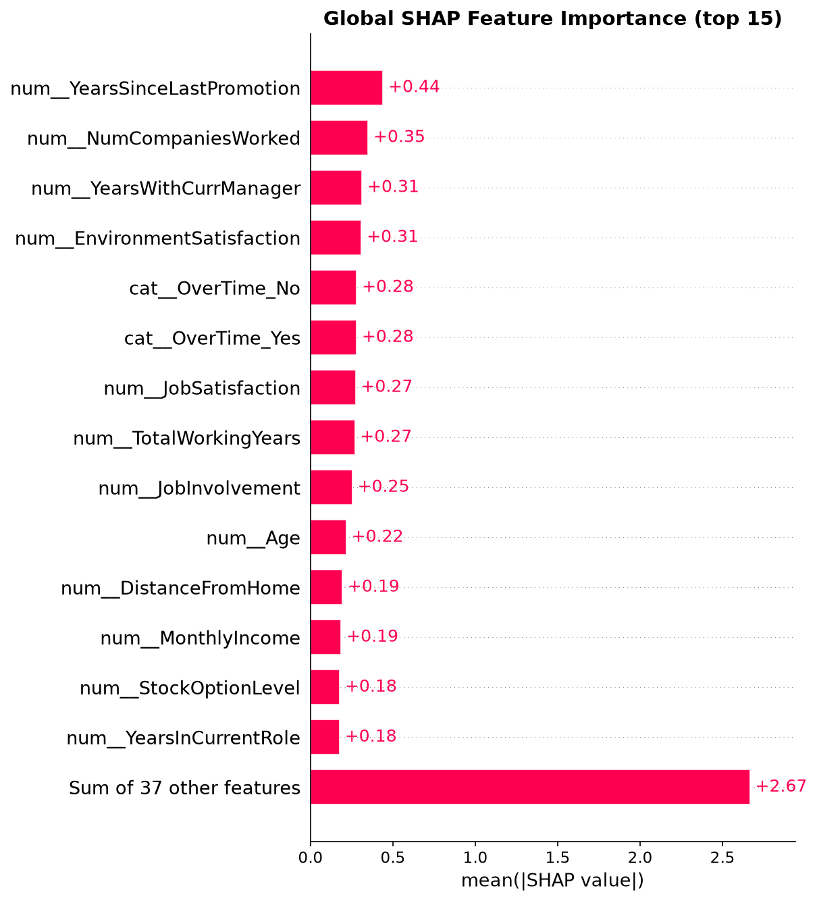

### Waterfall — why ONE specific high-risk employee looks risky
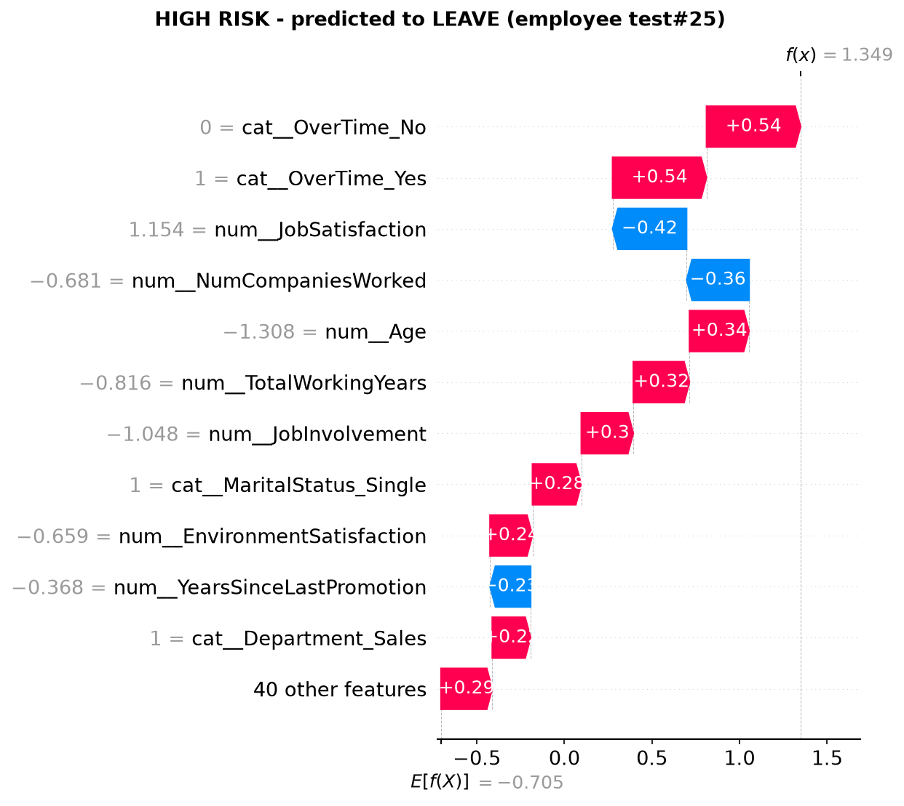

### Waterfall — a low-risk employee (blue pulls it down)
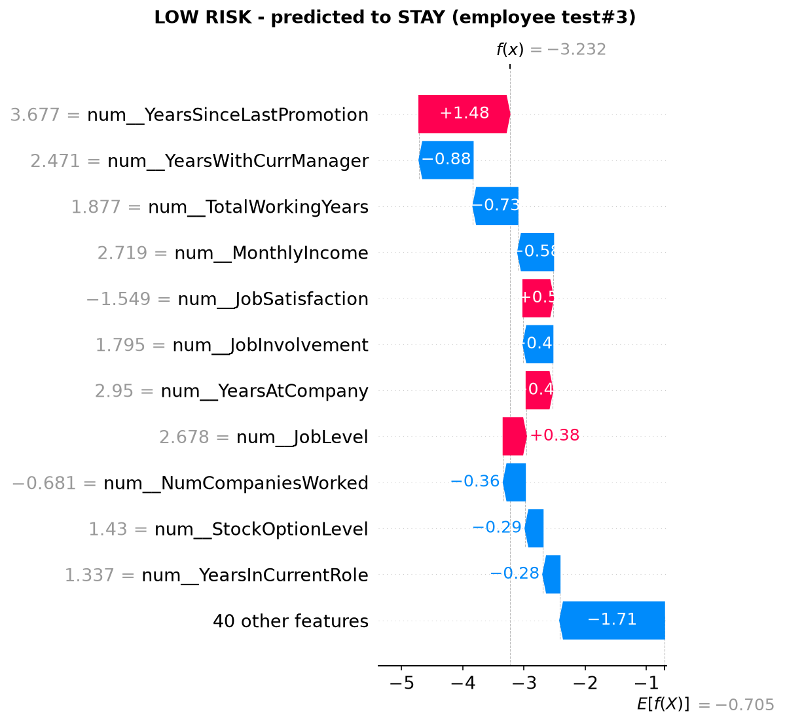

From these explanations we built **`ACTION_RULES`** in `src/explain.py` — a map from
the top SHAP factors to human sentences HR can act on (example: a large positive
contribution from *Overtime* triggers *"Review the overtime workload"*). This is
what turns the report from "you have 36% risk" into **"here's what to do."**

---

## 12. Step 7 — Business Value & Cost–Benefit

Numbers come from `cost_benefit` in `src/train.py` / notebook 03.

**Assumptions (conservative, industry-standard):**
- Replacement cost = **1.5× annual salary**,
- Intervention cost = **$2,500 per employee** (stay interview + small change).

**Result for the top-30 highest-risk test employees:**
- Expected savings from caught leavers: **≈ $1.71M**
- Intervention spend: **≈ $75k**
- **Net ≈ $1.65M → ~22× return on the program**

```
   ┌────────────────────────────────────────────┐
   │ Net business value of top-30 interventions │
   │  $1.65M saved  ≈  22x ROI                  │
   └────────────────────────────────────────────┘
```

This is the "so what?" that separates a homework notebook from a decision-support
tool — and the metric to quote in an interview.

---

## 13. Step 8 — The Web App

Built with **Flask**, styled with modern **CSS**, explained with **SHAP**.

### Screenshot — input form (index page)
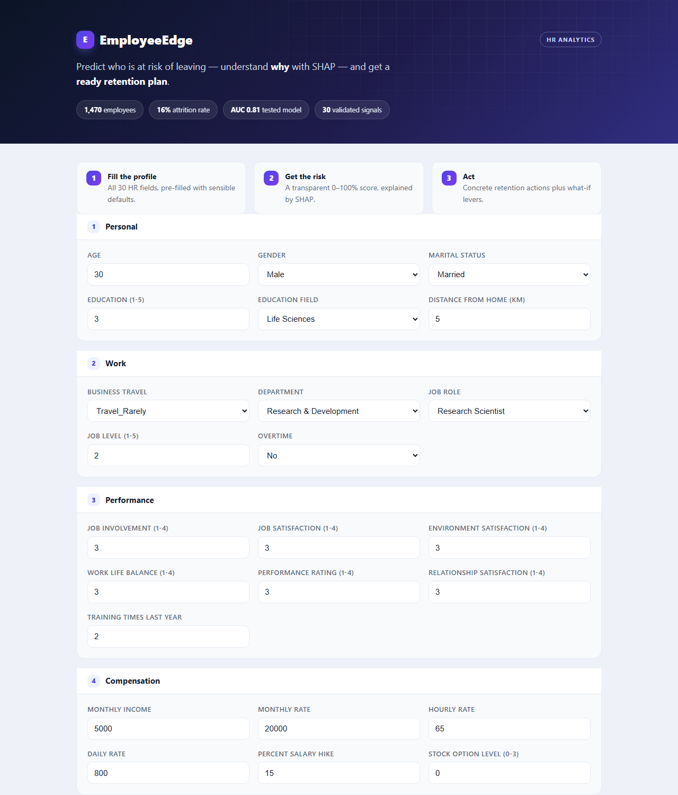

The form groups the **30 fields** into Personal / Work / Performance / Compensation /
Tenure, with sensible defaults so you can change a few values and press the button.

### Screenshot — result page
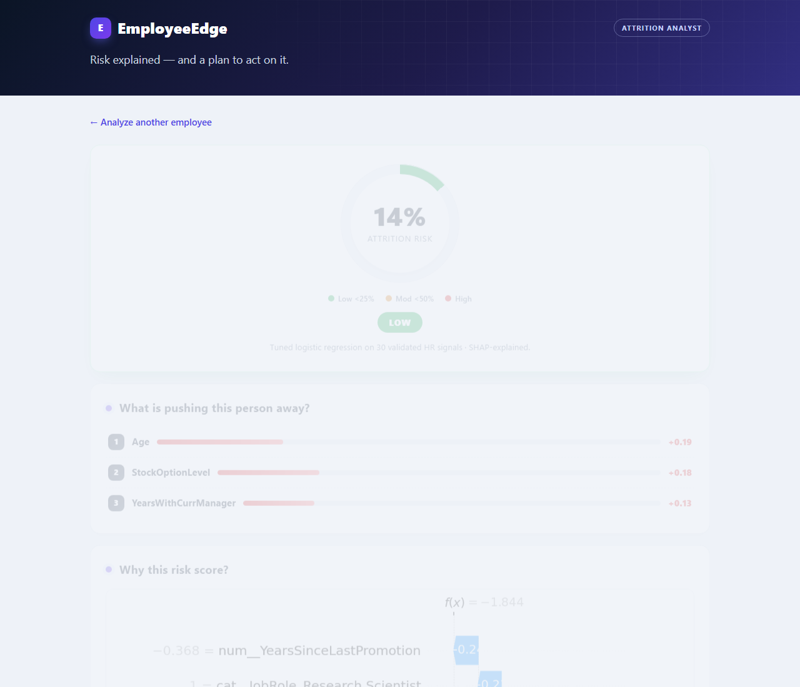

The result page shows:
1. **Risk gauge** — 0–100% ring, colour-coded Low / Moderate / High
2. **Top pushing factors** with contribution bars (from SHAP)
3. **SHAP waterfall** — full "why this score?" visual
4. **Retention action plan** — ready-to-run checklist
5. **What-if simulator** — remove overtime / +20% income / raise satisfaction,
   each re-running the real model (no retraining)
6. **Employee profile** tags — so you can see exactly what you asked about

### How the app talks to the model (`app/app.py`)
```
Browser ──POST form──▶ Flask /predict
                          │
              build_row(): form → 30-column DataFrame
                          │
        pipeline.predict_proba()  → risk probability
                          │
   SHAP (explain_raw_rows) → factors + waterfall + action plan
                          │
      whatif() sims re-run pipeline on modified rows
                          │
                    render result.html
```

Model and explainer load **lazily once** (module-level cache), so the first request
is slower (~a few seconds) and the rest are fast.

---

## 14. Step 9 — Deployment

### GitHub
The repo is public: **https://github.com/pardeepkaur0027/EmployeeEdge**

Git keeps the full history (EDA → preprocessing → modeling → app → fixes). Every
milestone is its own commit, so a reviewer can read the project like a story.

### Render (free cloud hosting)
- `render.yaml` defines the service (web, Python, free tier).
- Build: `pip install -r app/requirements.txt`
- Run: `gunicorn -w 1 --timeout 120 -b 0.0.0.0:$PORT app.app:app`
- **Auto-deploys on every `git push`** — the live site always matches the repo.
- A fun deployment bug we fixed: the story of `app:app` vs `app.app:app`.

  > `app/` is a *namespace package* (no `__init__.py`), so `gunicorn app:app`
  > import "app" the empty package and crashed. The correct target
  > `gunicorn app.app:app` imports the `app/app.py` module and finds the Flask app.
  > We later added `app/__init__.py` to make it a proper package.

**Live URL: https://employeeedge.onrender.com**

---

## 15. How to Run This Project

```powershell
cd "C:\Users\sonyp\Documents\Default Project\EmployeeEdge"
.venv\Scripts\Activate.ps1          # activate virtual environment
python -m pip install -r app\requirements.txt

# 1) Run the checks
python smoke_test.py                # model + SHAP + action plan
python app_smoke_test.py            # Flask routes

# 2) Run the app locally
python app\app.py
# open http://127.0.0.1:5000
```

> **Troubleshooting "ModuleNotFoundError: shap / xgboost":** you ran with the wrong
> Python. Activate the venv first (command above), or install the two packages into
> that Python: `python -m pip install shap xgboost`.

---

## 16. Project Structure

```
EmployeeEdge/
├── data/                        # raw CSV (bundled, 228 KB)
├── notebooks/
│   ├── 01_EDA.ipynb             # exploration + visual insights
│   ├── 02_Preprocessing.ipynb   # splits, transformers, no-leakage pipeline
│   └── 03_Modeling.ipynb        # 3 models, tuning, SHAP, cost-benefit
├── outputs/
│   ├── models/model.joblib      # saved winning Pipeline
│   ├── plots/                   # all charts in this report
│   └── screenshots/             # app screenshots
├── src/
│   ├── preprocess.py            # load/split/prepare (single source of truth)
│   ├── train.py                 # training, tuning, eval, cost-benefit
│   └── explain.py               # SHAP + action rules
├── app/
│   ├── app.py                   # Flask logic
│   ├── templates/index.html     # input form
│   ├── templates/result.html    # results page
│   ├── static/style.css         # modern styling
│   └── requirements.txt         # app dependencies
├── smoke_test.py                # end-to-end test 1 (ML + SHAP)
├── app_smoke_test.py            # end-to-end test 2 (Flask routes)
├── render.yaml                  # Render blueprint
└── REPORT.md                    # this file
```

---

## 17. Limitations

- **Imbalance still costs precision** — many flagged people won't leave (that's the
  deliberate recall-favoring trade). Every flag should be a *conversation*, not a
  verdict.
- **Single dataset, single point in time** — no time-series trend; a live version
  would retrain monthly.
- **Few deep signals** — survey ratings are coarse (1–4). Free-text, engagement,
  and performance systems add information this dataset can't.
- **Correlated features** (income & tenure) make coefficient "importance" readings
  fuzzy — SHAP handles this more fairly than raw coefficients.

---

## 18. Future Work

- Add a **monthly retrain job** (GitHub Actions / Render cron) so the model stays fresh.
- Add an **API endpoint** (`/predict_json`) for HR systems to integrate.
- Add **more what-if levers** (promotion, lateral move, remote work, move location).
- Try **AutoML / ensemble stacking** and deeper hyperparameter search.
- Add **drift monitoring** — track when live inputs stop matching training data.

---

## 19. Key Takeaways

1. **Honest evaluation beats fancy models** — a pipeline with zero leakage and the
   right metrics did 90% of the work; LR beat fancier models anyway.
2. **Imbalanced problems**: don't use accuracy — use AUC, recall at threshold, F1.
3. **Explainability is a feature** — SHAP turns a scary black box into decisions HR
   can act on, and it's what makes the demo feel real.
4. **Bake business value in** — a model is only as good as the ROI story it tells.
5. **End-to-end matters** — a notebook is homework; a deployed app with tests is a portfolio.

---

*Built with ❤️ as an HR Analytics capstone. Live at https://employeeedge.onrender.com*